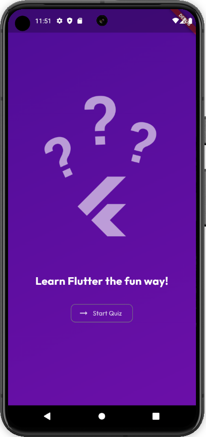
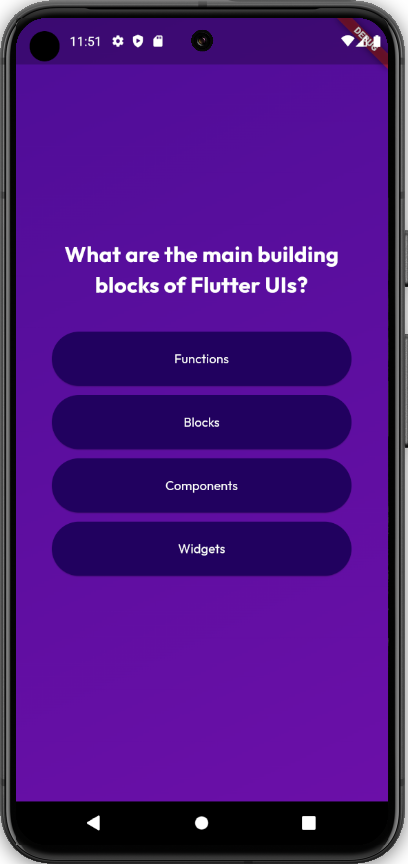
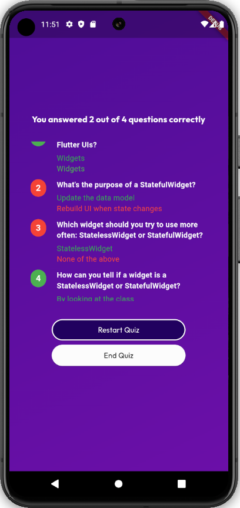

# Quiz Application - Flutter Project


Welcome to the **Quiz Application** repository! This project is a Flutter-based mobile application that provides users with an engaging way to take quizzes on various topics. It features interactive multiple-choice questions, score tracking, and detailed results analysis.

---

## 🛠️ Table of Contents
- [Project Overview](#project-overview)
- [Technologies Used](#technologies-used)
- [Features](#features)
- [Installation Guide](#installation-guide)
- [App Structure](#app-structure)
- [Preview](#preview)
- [More Info](#more-info)

---

## 🌟 Project Overview

The **Quiz Application** is designed to offer an enjoyable learning experience by allowing users to take quizzes on different topics. The app includes features such as real-time score tracking, detailed results with correct and incorrect answers, and a responsive UI optimized for both Android and iOS.

Key Focus Areas:
- **Interactive Quizzes**: A dynamic quiz experience with multiple-choice questions.
- **Score Tracking**: Real-time updates on user scores.
- **Results Analysis**: Detailed results to review quiz performance.
- **Cross-Platform Support**: Built with Flutter for seamless usage on Android and iOS devices.

---

## 🚀 Technologies Used

- **Flutter**: Core framework for mobile app development.
- **Dart**: Programming language for Flutter applications.
- **Provider**: For state management.
- **SQLite**: Local storage for quiz data (optional, for offline mode).
- **HTTP**: For fetching remote quiz data (optional, for online mode).

---

## 🔑 Features

### 1. **Quiz Management**
- Multiple-choice questions with a clean and intuitive interface.
- Shuffle options to provide a unique experience for each attempt.

### 2. **Score Tracking**
- Tracks user scores in real-time during the quiz.
- Displays the final score upon quiz completion.

### 3. **Detailed Results**
- View correct and incorrect answers after completing the quiz.
- Option to retake the quiz for better performance.

### 4. **Responsive Design**
- Optimized UI for mobile and tablet devices.
- Dark mode support for better user experience in low-light conditions.

---

## 📦 Installation Guide

### 1. Clone the Repository
Clone the repository using Git:

```bash
git clone https://github.com/Josegrd/quiz-app-flutter.git
```


### 2. Install Flutter
Ensure you have Flutter installed on your system. Follow the official Flutter installation guide.

### 3. Install Dependencies
Navigate to the project directory and install dependencies:

```bash
cd adv_basics
flutter pub get
```

### 4. Run the Application
Run the app on an emulator or a connected device:

```bash
flutter run
```

### 5. (Optional) Connect to a Backend
If using a backend API for quiz data:

```bash
Configure the API URL in lib/constants/api_constants.dart.
Update the http request logic in quiz_service.dart.
```

## 📂 App Structure
Here's an overview of the project's directory structure:

```bash
├── lib/
│   ├── models/         # Data models for quiz and results
│   ├── screens/        # UI screens for different pages
│   ├── services/       # Business logic and API integration
│   ├── widgets/        # Reusable components (buttons, cards, etc.)
│   ├── constants/      # App constants (colors, strings, etc.)
│   └── main.dart       # Application entry point
├── assets/
│   ├── images/         # Static images for the app
│   ├── fonts/          # Custom fonts
├── pubspec.yaml        # Project dependencies
└── test/               # Unit and widget tests
```

## 🖼️ Preview
### 1. Home Screen
- Displays a list of available quizzes with topics. <br/>



### 2. Quiz Screen
- Allows users to answer multiple-choice questions interactively. <br/>




### 3. Results Screen
- Shows detailed quiz results, including correct and incorrect answers, and button to end or restart quiz. <br/>



## 📝 More Info
For updates, questions, or collaboration opportunities, feel free to reach out through:

- **Twitter/X: @jsgrd8**
- **or contact from here**

## ❓ FAQs
### 1. How do I add new quiz topics?
- Add the quiz data to the backend API or update the local JSON file located in assets/data/quiz_data.json.
### 2. Can the app work offline?
- Yes, using the included SQLite integration, quizzes can be accessed offline.
### 3. How can I customize the app's theme?
- Modify the ThemeData in main.dart to change colors, fonts, or other styling elements.
### 4. What should I do if I encounter issues with API requests?
- Check the API URL in lib/constants/api_constants.dart and ensure the backend server is running.
### 5. How can I contribute to this project?
- Fork the repository, make your changes, and submit a pull request. Contributions are welcome!
